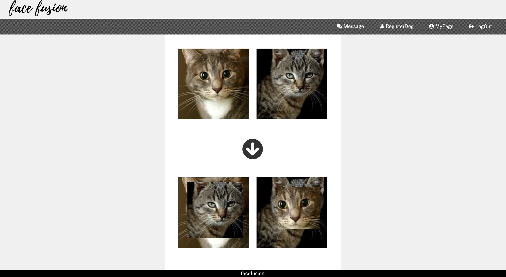

# README
## 【facefusion】取扱説明書

## 本番環境URL
* https://facefusion.herokuapp.com
* デプロイ済みですが、ローカル環境では完成しておりますが本番環境でエラーが出ており修正中です。

## テストアカウント
* メールアドレス　test@test.com
* パスワード　techcamp72

## 制作経緯
##### 犬種で、ミックス犬が人気だが、どのような姿に育つのかは成犬になるまでわかりません。
##### そこで、両親の画像を合成し、子供の成犬予想図を作ろうと思い、本アプリを作成しました。

## 開発環境
* Html & Css
* JavaScript
* JQuery
* Python3.7.6
* Django2.1.7
* mySQL
* AWS
* Heroku
* GitHub
* Visual Studio Code

## 実装内容
#### 画像合成機能

2枚の画像をアップロードすると、顔検出して入れ替えた画像を出力します  
(犬の顔検出用のカスケードファイルを自作中の為、現状は猫の画像のみの処理)

* ユーザー登録機能
* チャット機能

## 今後の実装予定
* 記事投稿、編集、削除機能
* お気に入り機能
##### アプリ開発中の為、今後上記機能を実装していく予定です。
##### 完成形のサイトの流れは下記の様な形を予定しております。
他のユーザーの登録した画像を一覧から選択 
↓ 
選択した画像と自分の登録した画像を使って合成 
↓ 
気に入ったらそのユーザーをお気に入り登録 
↓ 
お互いがお気に入り登録したらマッチングし、チャットが可能になり、犬のお見合い 
