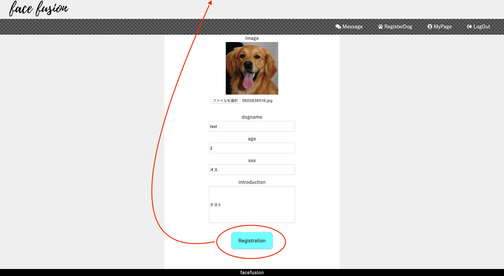

# README
## 【facefusion】取扱説明書

## 本番環境URL
* https://facefusion.herokuapp.com
* デプロイ済みですが、ローカル環境では完成しておりますが本番環境でエラーが出ており修正中です。

## テストアカウント
* メールアドレス　test@test.com
* パスワード　techcamp72

## 制作経緯
##### 犬種で、ミックス犬が人気だが、どのような姿に育つのかは成犬になるまでわかりません。
##### そこで、両親の画像を合成し、子供の成犬予想図を作ろうと思い、本アプリを作成しました。

## 開発環境
* Html & Css
* JavaScript
* JQuery
* Python3.7.6
* Django2.1.7
* mySQL
* AWS
* Heroku
* GitHub
* Visual Studio Code

## 実装内容
#### 画像合成機能

2枚の画像をアップロードすると、顔検出して入れ替えた画像を出力します  
(犬の顔検出用のカスケードファイルを自作中の為、現状は猫の画像のみの処理)
#### ユーザー登録機能
</img>
</img>
ユーザーネーム、メールアドレス、パスワードにてユーザー登録が可能です。  
今後、googleアカウントを利用してのログイン機能を実装する予定です。
#### ペット登録機能

ユーザーのペットを登録することができます。  
登録したペットはマイページに表示されます。
#### チャット機能

ユーザー間でチャットのやりとりができます。  
現在はチャット機能だけですが、マッチングアプリの様に、お互いがペットの合成結果にいいねをしたらやりとりができる様に実装中です。

## 今後の実装予定
* 犬の検出用のカスケードファイル作成
* お気に入り機能
* googleアカウントを用いてのユーザー登録、ログインを実装
